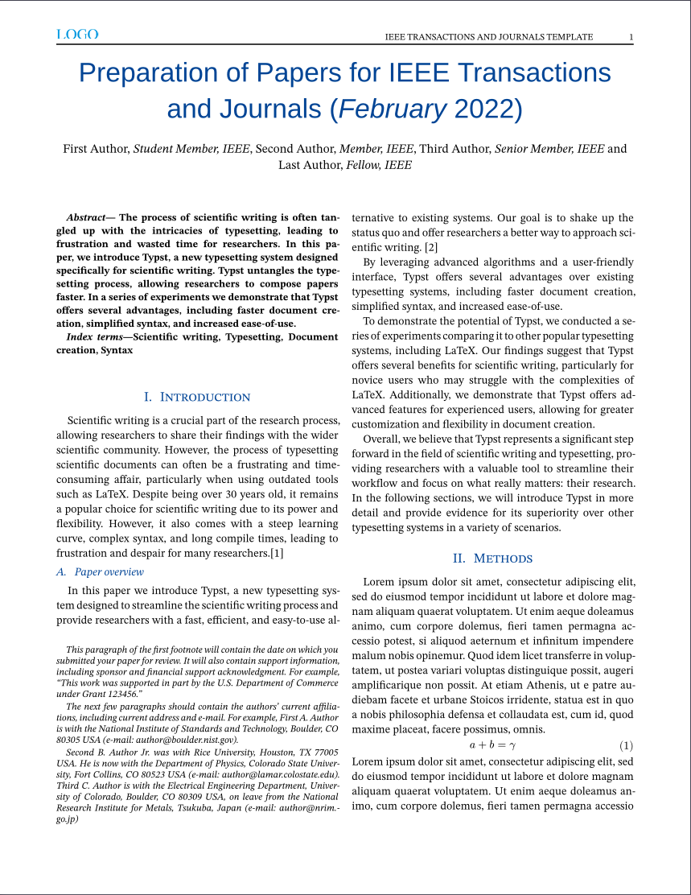
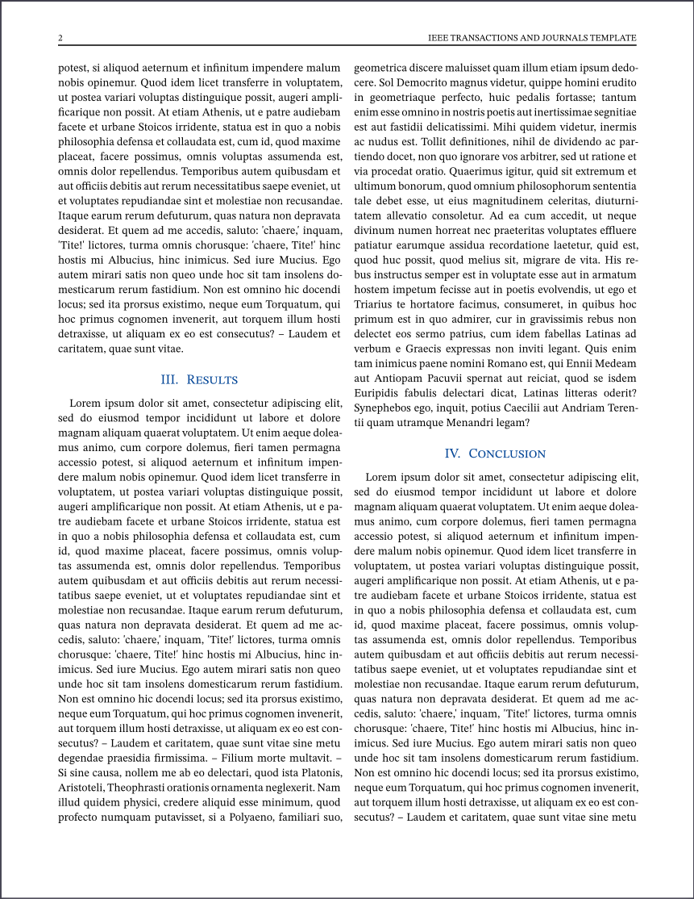
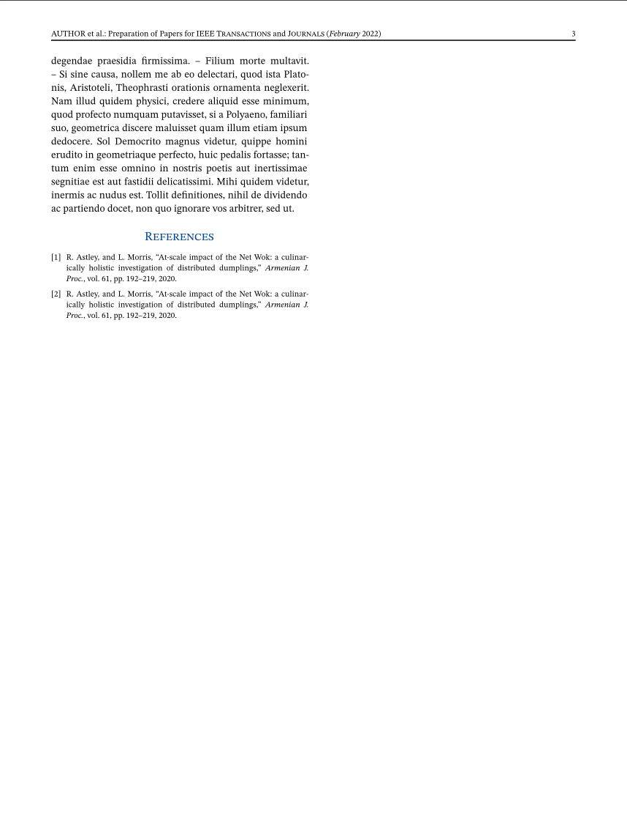

# ieee-trans-template

IEEE-Trans template for [Typst](https://github.com/typst/typst).



**Note:** This template is still not 100% replication of `IEEE-trans.cls` due to the lacks of following features

* Floating footnote

  In LaTeX, a very long footnote will auto-spread into two columns. Typst currently doesn't do that out-of-the-box (yet).

* Two-column floating figure



PR to adjust this template is always welcome, or just [fork](https://en.wikipedia.org/wiki/Fork_(software_development)) it.

## License

This template use [Do What The Fuck You Want](LICENSE) license **except** for those Arimo font (Arimo-.*\\.ttf) and logo.png.

## Preview

* **First Page**

* **Second Page**

* **Third Page**

